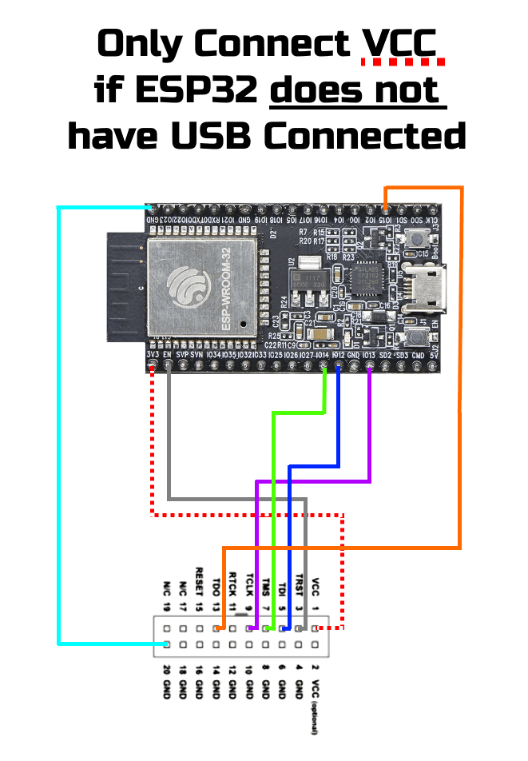
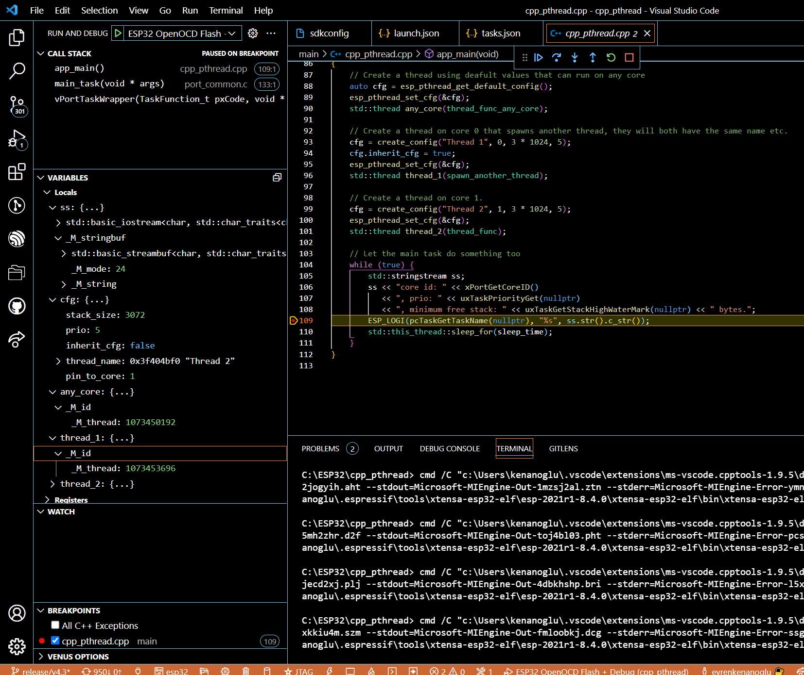

# ESP32 DEBUGGING WITH JLINK (USING OPENOCD) OVER JTAG INTERFACE

In this project it's described how to set up a debugging environment for your esp32 on vscode and most important thing with a JLINK!!!
This example tested with examples/cxx/pthread example in esp-idf sdk.

This project is generated combination of these two reference
1.https://mcuoneclipse.com/2019/09/22/eclipse-jtag-debugging-the-esp32-with-a-segger-j-link/

2.https://www.youtube.com/watch?v=uq93H7T7cOQ&t=8s&ab_channel=YuriR

## Configuration

Required Tools

- Vscode and Espressif IDF Extension
- ESP-IDF must be already installed on your computer and perfoming on vscode with no problem.

### Hardware Connections



### Install WinUSB to Jlink Driver

Please follow first and use https://visualgdb.com/UsbDriverTool/ tool and install WinUSB driver to Jlink

### OpenOCD Configuration

C:\Users\\%USERNAME%\\.espressif\tools\openocd-esp32\v0.10.0-esp32-20210401\openocd-esp32\share\openocd\scripts\board\

In this location pick your board cfg file.

In this case it was esp32-wroom-32.cfg

esp32-wroom-32-modified.cfg file is created so we didn't make any changes in official document.

Modification is setting an adapter_khz 10000

You can modify adapter_khz but more than 10000 is not recommended. It leads error connection between Jlink and ESP32

```
echo "WARNING: boards/esp-wroom-32.cfg is deprecated, and may be removed in a future release."
set ESP32_FLASH_VOLTAGE 3.3
adapter_khz 10000 
source [find target/esp32.cfg]
```

Place "esp32-wroom-32-modified.cfg" file into that location.
C:\Users\\%USERNAME%\\.espressif\tools\openocd-esp32\v0.10.0-esp32-20210401\openocd-esp32\share\openocd\scripts\board\

### .vscode Files Modification

Copy paste files under .vscode folder into your project under .vscode folder

- [ ] launch.json
- [ ] tasks.json
- [ ] c_cpp_properties.json

## Starting Debugging

In run and debug section, it will appear these 3 options

- ESP32 OpenOCD Reset + Debug
- ESP32 Build + OpenOCD Flash + Debug
- ESP32 OpenOCD Flash + Debug

You can perform combinations of Debugging, Building, Flashing

### Output

```
Open On-Chip Debugger  v0.10.0-esp32-20210401 (2021-04-01-15:46)
Licensed under GNU GPL v2
For bug reports, read
        http://openocd.org/doc/doxygen/bugs.html
none
WARNING: boards/esp-wroom-32.cfg is deprecated, and may be removed in a future release.
Info : Listening on port 6666 for tcl connections
Info : Listening on port 4444 for telnet connections
Info : J-Link V10 compiled Sep 24 2021 16:39:44
Info : Hardware version: 10.10
Info : VTarget = 3.300 V
Info : clock speed 10000 kHz
Info : JTAG tap: esp32.cpu0 tap/device found: 0x120034e5 (mfg: 0x272 (Tensilica), part: 0x2003, ver: 0x1)
Info : JTAG tap: esp32.cpu1 tap/device found: 0x120034e5 (mfg: 0x272 (Tensilica), part: 0x2003, ver: 0x1)
Info : esp32.cpu0: Target halted, PC=0x400D5C2C, debug_reason=00000001
Info : esp32.cpu1: Target halted, PC=0x4010B476, debug_reason=00000000
Info : Listening on port 3333 for gdb connections
Info : accepting 'gdb' connection on tcp/3333
Info : esp32.cpu0: Target halted, PC=0x40091C2A, debug_reason=00000001
Info : Set GDB target to 'esp32.cpu0'
Info : Flash mapping 0: 0x10020 -> 0x3f400020, 102 KB
Info : Flash mapping 1: 0x30020 -> 0x400d0020, 246 KB
Info : esp32.cpu0: Target halted, PC=0x40091C2A, debug_reason=00000001
Info : Auto-detected flash bank 'esp32.cpu0.flash' size 4096 KB
Info : Using flash bank 'esp32.cpu0.flash' size 4096 KB
Info : esp32.cpu0: Target halted, PC=0x40091C2A, debug_reason=00000001
Info : Flash mapping 0: 0x10020 -> 0x3f400020, 102 KB
Info : Flash mapping 1: 0x30020 -> 0x400d0020, 246 KB
Info : Using flash bank 'esp32.cpu0.irom' size 248 KB
Info : esp32.cpu0: Target halted, PC=0x40091C2A, debug_reason=00000001
Info : Flash mapping 0: 0x10020 -> 0x3f400020, 102 KB
Info : Flash mapping 1: 0x30020 -> 0x400d0020, 246 KB
Info : Using flash bank 'esp32.cpu0.drom' size 104 KB
Info : New GDB Connection: 1, Target esp32.cpu0, state: halted
Info : JTAG tap: esp32.cpu0 tap/device found: 0x120034e5 (mfg: 0x272 (Tensilica), part: 0x2003, ver: 0x1)
Info : JTAG tap: esp32.cpu1 tap/device found: 0x120034e5 (mfg: 0x272 (Tensilica), part: 0x2003, ver: 0x1)
Info : esp32.cpu0: Debug controller was reset.
Info : esp32.cpu0: Core was reset.
Info : esp32.cpu0: Target halted, PC=0x500000CF, debug_reason=00000000
Info : esp32.cpu0: Core was reset.
Info : esp32.cpu0: Target halted, PC=0x40000400, debug_reason=00000000
Info : esp32.cpu1: Debug controller was reset.
Info : esp32.cpu1: Core was reset.
Info : esp32.cpu1: Target halted, PC=0x40000400, debug_reason=00000000
Info : JTAG tap: esp32.cpu0 tap/device found: 0x120034e5 (mfg: 0x272 (Tensilica), part: 0x2003, ver: 0x1)
Info : JTAG tap: esp32.cpu1 tap/device found: 0x120034e5 (mfg: 0x272 (Tensilica), part: 0x2003, ver: 0x1)
Info : esp32.cpu0: Debug controller was reset.
Info : esp32.cpu0: Core was reset.
Info : esp32.cpu0: Target halted, PC=0x500000CF, debug_reason=00000000
Info : esp32.cpu0: Core was reset.
Info : esp32.cpu0: Target halted, PC=0x40000400, debug_reason=00000000
Info : esp32.cpu1: Debug controller was reset.
Info : esp32.cpu1: Core was reset.
Info : esp32.cpu1: Target halted, PC=0x40000400, debug_reason=00000000
Info : esp32.cpu0: Target halted, PC=0x40091C2A, debug_reason=00000001
Info : Flash mapping 0: 0x10020 -> 0x3f400020, 102 KB
Info : Flash mapping 1: 0x30020 -> 0x400d0020, 246 KB
Info : esp32.cpu0: Target halted, PC=0x40091C2A, debug_reason=00000001
Info : Auto-detected flash bank 'esp32.cpu1.flash' size 4096 KB
Info : Using flash bank 'esp32.cpu1.flash' size 4096 KB
** Programming Started **
Info : esp32.cpu0: Target halted, PC=0x40091C2A, debug_reason=00000001
Info : PROF: Data transferred in 140.686 ms @ 199.025 KB/s
Info : esp32.cpu0: Target halted, PC=0x40091C2A, debug_reason=00000001
** Programming Finished **
** Verify Started **
Info : PROF: Data transferred in 124.857 ms @ 196.85 KB/s
Info : esp32.cpu0: Target halted, PC=0x40091C2A, debug_reason=00000001
** Verified OK **
Info : JTAG tap: esp32.cpu0 tap/device found: 0x120034e5 (mfg: 0x272 (Tensilica), part: 0x2003, ver: 0x1)
Info : JTAG tap: esp32.cpu1 tap/device found: 0x120034e5 (mfg: 0x272 (Tensilica), part: 0x2003, ver: 0x1)
Info : esp32.cpu0: Debug controller was reset.
Info : esp32.cpu0: Core was reset.
Info : esp32.cpu0: Target halted, PC=0x500000CF, debug_reason=00000000
Info : esp32.cpu0: Core was reset.
Info : esp32.cpu0: Target halted, PC=0x40000400, debug_reason=00000000
Info : esp32.cpu1: Debug controller was reset.
Info : esp32.cpu1: Core was reset.
Info : esp32.cpu1: Target halted, PC=0x40000400, debug_reason=00000000
** Programming Started **
Info : esp32.cpu0: Target halted, PC=0x40091C2A, debug_reason=00000001
Info : PROF: Data transferred in 32.177 ms @ 124.312 KB/s
Info : esp32.cpu0: Target halted, PC=0x40091C2A, debug_reason=00000001
** Programming Finished **
** Verify Started **
Info : PROF: Data transferred in 31.264 ms @ 95.957 KB/s
Info : esp32.cpu0: Target halted, PC=0x40091C2A, debug_reason=00000001
** Verified OK **
Info : JTAG tap: esp32.cpu0 tap/device found: 0x120034e5 (mfg: 0x272 (Tensilica), part: 0x2003, ver: 0x1)
Info : JTAG tap: esp32.cpu1 tap/device found: 0x120034e5 (mfg: 0x272 (Tensilica), part: 0x2003, ver: 0x1)
Info : esp32.cpu0: Debug controller was reset.
Info : esp32.cpu0: Core was reset.
Info : esp32.cpu0: Target halted, PC=0x500000CF, debug_reason=00000000
Info : esp32.cpu0: Core was reset.
Info : esp32.cpu0: Target halted, PC=0x40000400, debug_reason=00000000
Info : esp32.cpu1: Debug controller was reset.
Info : esp32.cpu1: Core was reset.
Info : esp32.cpu1: Target halted, PC=0x40000400, debug_reason=00000000
** Programming Started **
Info : esp32.cpu0: Target halted, PC=0x40091C2A, debug_reason=00000001
Info : PROF: Data transferred in 2007.45 ms @ 203.243 KB/s
Info : esp32.cpu0: Target halted, PC=0x40091C2A, debug_reason=00000001
** Programming Finished **
** Verify Started **
Info : PROF: Data transferred in 2000.28 ms @ 202.12 KB/s
Info : esp32.cpu0: Target halted, PC=0x40091C2A, debug_reason=00000001
** Verified OK **
Info : JTAG tap: esp32.cpu0 tap/device found: 0x120034e5 (mfg: 0x272 (Tensilica), part: 0x2003, ver: 0x1)
Info : JTAG tap: esp32.cpu1 tap/device found: 0x120034e5 (mfg: 0x272 (Tensilica), part: 0x2003, ver: 0x1)
Info : esp32.cpu0: Debug controller was reset.
Info : esp32.cpu0: Core was reset.
Info : esp32.cpu0: Target halted, PC=0x500000CF, debug_reason=00000000
Info : esp32.cpu0: Core was reset.
Info : esp32.cpu0: Target halted, PC=0x40000400, debug_reason=00000000
Info : esp32.cpu1: Debug controller was reset.
Info : esp32.cpu1: Core was reset.
Info : esp32.cpu1: Target halted, PC=0x40000400, debug_reason=00000000
Info : esp32.cpu0: Target halted, PC=0x400D5C2C, debug_reason=00000001
Info : Set GDB target to 'esp32.cpu0'
Info : esp32.cpu1: Target halted, PC=0x400DB2AD, debug_reason=00000000
```



## NOTE

- Be careful in launch.json file in your esp32 project, bin and elf file must be generated with your project folder name. Otherwise it must be changed the .elf and .bin files' name in launch.json file
  For example;

```
        {
            "preLaunchTask": "Build+GDB Server ESP32",
            "name": " ESP32 Build + OpenOCD Flash + Debug",
            "type": "cppdbg",
            "request": "launch",
            "cwd": "${workspaceFolder}/build",
            "program": "${workspaceRoot}/build/${workspaceFolderBasename}.elf", //!!! Here .elf file 
            "miDebuggerPath": "${command:espIdf.getXtensaGdb}",
            "setupCommands": [
                { "text": "target remote 127.0.0.1:3333" },
                { "text": "set remote hardware-watchpoint-limit 2" },
                { "text": "monitor reset halt" },
                { "text": "flushregs" },
                { "text": "mon program_esp build/bootloader/bootloader.bin 0x1000 verify"},
                { "text": "mon program_esp build/partition_table/partition-table.bin 0x8000 verify"},
                { "text": "mon program_esp build/${workspaceFolderBasename}.bin 0x10000 verify"},  //!!! Here .bin file 
                { "text": "monitor reset halt" },
                { "text": "flushregs" }
            ]
        },
```

- -c \"set ESP_RTOS none\" flag for openocd is needed for debugging not to be fragile
- Without this flag, debugging session doesn't start couple times you have to try and when it starts it has a benefit as showing Threads running.
- You can change this in tasks.json file in that sections;

```
        {
            "label": "OpenOCD: Start JTAG openOCD over JLINK",
            "type": "shell",
            "presentation": {
                "echo": true,
                "reveal": "never",
                "focus": false,
                "panel": "new"
            },
            "command": "clear & start openocd -c \"set ESP_RTOS none\" -f interface/jlink.cfg -f board/esp-wroom-32-modified.cfg", // !!!!! HERE
            "windows": {
                "command": "clear & start openocd.exe -c \"set ESP_RTOS none\" -f interface/jlink.cfg -f board/esp-wroom-32-modified.cfg", //${command:espIdf.getOpenOcdScriptValue}/esp-wroom-32-modified.cfg ${command:espIdf.getOpenOcdConfigs}
                "options": {
                    "env": {
                        "PATH": "${env:PATH};${config:idf.customExtraPaths}"
                    }
                }
            },
            "options": {
                "env": {
                    "PATH": "${env:PATH}:${config:idf.customExtraPaths}"
                }
            },
            "problemMatcher": {
                "owner": "cpp",
                "fileLocation": "absolute",
                "pattern": {
                    "regexp": "^(.*):(\\d+):(\\d+):\\s+(warning|error):\\s+(.*)$",
                    "file": 1,
                    "line": 2,
                    "column": 3,
                    "severity": 4,
                    "message": 5
                }
            }
        },
```
